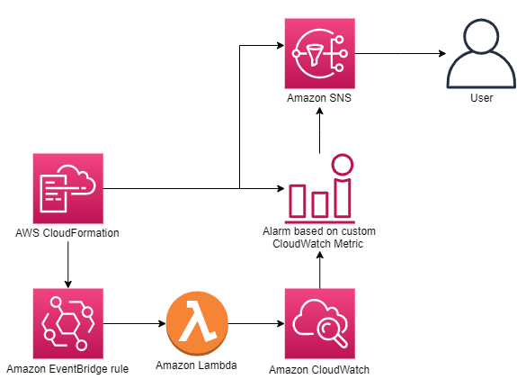

## Using Custom Amazon CloudWatch Metrics to Monitor Amazon EC2 Reserved Instance Expiration

This solution deploys a custom Amazon CloudWatch metric published via an AWS Lambda function and an Amazon Simple Notification Service (Amazon SNS) topic for notification when the alarm exceeds the user-defined threshold to allow monitoring of the days remaining for Amazon EC2 Reserved Instances.

CloudWatch allows you to monitor CloudWatch custom metrics (Amazon EC2 Reserved Instance days remaining) to deliver better insights into your resources and provide you with notifications when the defined threshold you configure is breached.

## Solution Overview
The following solution enables users to receive an email notification when the Amazon EC2 Reserved Instance has fewer days remaining than a specified threshold. This solution uses CloudWatch, Amazon SNS, Amazon EventBridge, AWS CloudFormation, and Lambda.

The following diagram illustrates the architecture in this post:

	

1.	CloudFormation deploys the EventBridge rule, Amazon SNS topic, CloudWatch alarm, and Lambda Invocation Permission.
2.	EventBridge invokes the Lambda function on the user-defined cadence.
3.	Lambda adds a custom metric (RI Days remaining) to CloudWatch metrics when invoked.
4.	CloudWatch alarm sends a notification to Amazon SNS when in the alarm state.
5.	Amazon SNS emails the user that the Amazon EC2 Reserved Instance is less than the user-defined parameter.

## Prerequisites

You must have the following:
	•	An AWS account with AWS Identity and Access Management (IAM) permissions to access CloudWatch, EventBridge, Lambda, and Amazon SNS.
	•	IAM permissions for CloudFormation to deploy the template.
	•	An IAM role created for the Lambda function with least privilege access to CloudWatch and EventBridge.

When testing, make sure that you deploy this solution into an AWS account with an active Amazon EC2 Reserved Instance.

## Deployment Instructions
First, deploy the lambda_function.py Lambda function found in the <a href="https://github.com/aws-samples/aws-cloud-operation-samples/tree/main/monitoring-expiring-aws-reserved-instances/src">src</a> folder. You can then deploy the template.yaml file also located in the <a href="https://github.com/aws-samples/aws-cloud-operation-samples/tree/main/monitoring-expiring-aws-reserved-instances/src">src</a> folder.
